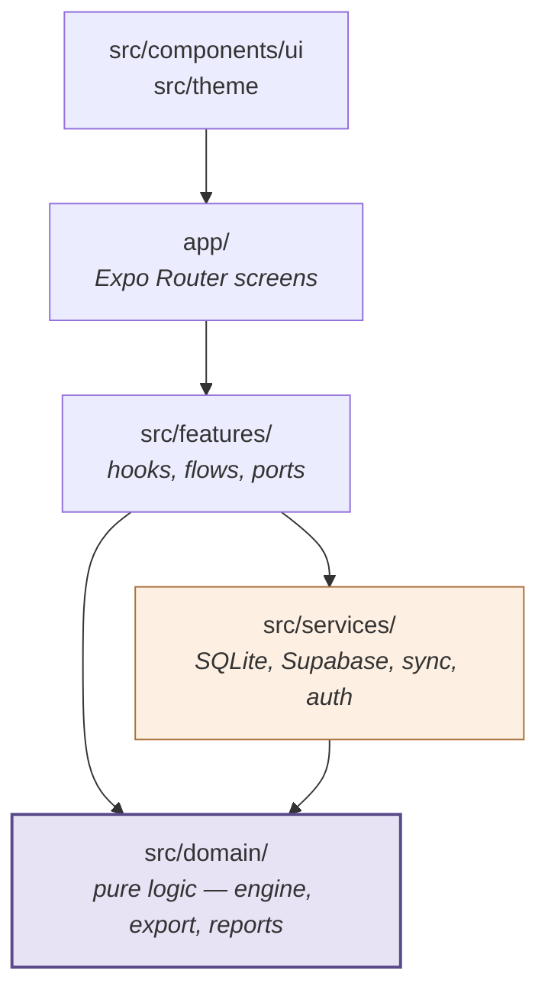
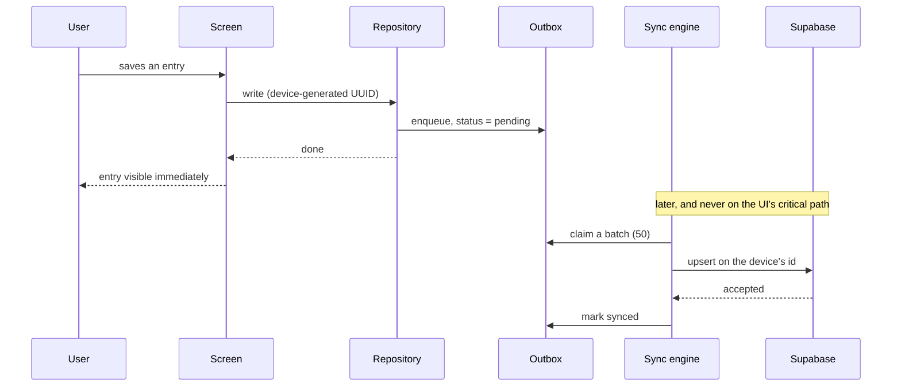
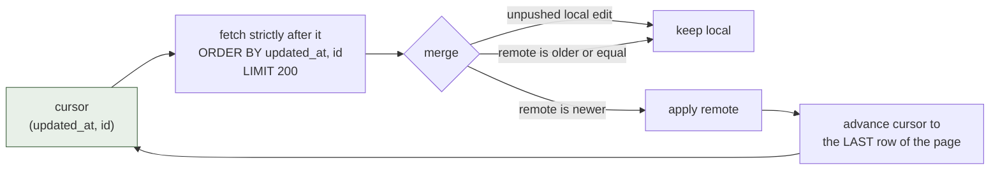
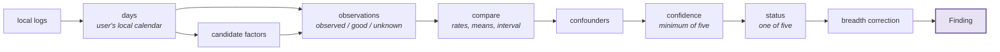
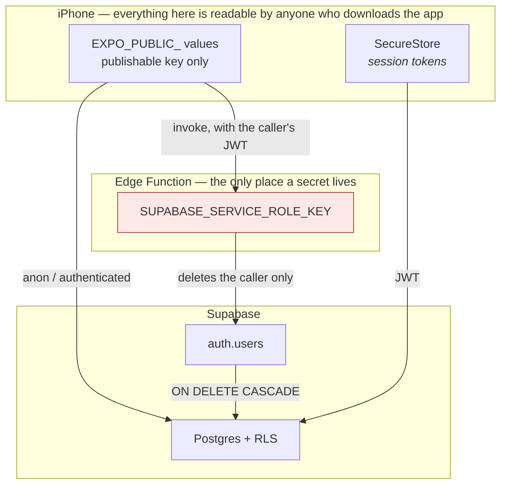

# GutSignal — Architecture

The shape of the system, in pictures. `CLAUDE.md` §47 expects this file; it had never been
written, and the review asked for the diagrams.

**This is deliberately thin.** The reasoning lives where it belongs and is not repeated here: the
schema and threat model in [PROJECT_PLAN.md](PROJECT_PLAN.md), the analysis method in
[PATTERN_ENGINE.md](PATTERN_ENGINE.md), the data protections in
[PRIVACY_SECURITY.md](PRIVACY_SECURITY.md), and every decision in [DECISIONS.md](DECISIONS.md).
Duplicating any of it here is how five documents come to disagree, which is the problem
[PROJECT_STATUS.md](PROJECT_STATUS.md) exists to stop.

---

## 1. The layers

Dependencies point one way. `domain` knows nothing about React, Supabase or SQLite, which is what
makes the pattern engine testable without any of them — and portable to an Edge runtime later
(risk R-09).

The rule worth stating: **`domain` never imports from `services` or `features`.** A repository is
handed to it, never reached for. Every failure path in the engine, the export flow and account
deletion is testable because of that one constraint.

---

## 2. Writing a log — the offline path

The UI never waits on the network. A log is durable before anything is sent, which is the whole
of `CLAUDE.md` §15.

The id comes from the device, so a retry after an ambiguous timeout **updates** the row it already
created rather than creating a second one. Nothing leaves the outbox until the server confirms it.

---

## 3. Reading changes back — the pull

Two things are load-bearing and both were defects once. The cursor is a **pair**, because
`updated_at` is a transaction timestamp and a tie group wider than a page could never be paged past
(ADR-0043). And it advances to the last row **in cursor order**, not the largest timestamp — taking
the maximum was the defect itself.

A page that fails to apply leaves the cursor where it was, so it is retried rather than skipped
(ADR-0045).

---

## 4. From a diary to a finding

Deterministic end to end. No clock, no randomness, no model.

**An LLM may explain a finding. It may never produce one** (`CLAUDE.md` §18). Nothing in this
path touches a network.

Findings are **recomputed from local logs** on every open rather than read back, so Insights works
offline and can never show a conclusion the user's own diary no longer supports.

---

## 5. Where the secrets are, and are not

The delete endpoint **takes no user id**. It reads the caller's id from the verified token, so
there is no capability to aim it at anyone else — an authorisation check can be removed by
accident, a capability that was never built cannot (T13, ADR-0042).

---

## 6. What is not in these diagrams

Because it does not exist yet: Experiments, Ask My Gut, RevenueCat, HealthKit, meal photos and any
AI provider. When one arrives, it belongs on the diagram it changes and in
[DECISIONS.md](DECISIONS.md) — and if it moves a boundary in §5, in the threat table too.
